# PLATAFORMA SOLIDARIDAD ESCUELA
## ESCUELA COLOMBIANA DE INGENIERIA JULIO GARAVITO
## CICLOS DE VIDA DEL DESARROLLO DE SOFTWARE - CVDS
## 2021 - 1

## Integrantes y roles en el equipo :busts_in_silhouette:
| Nombre y Apellido           | Rol                     | Usuario en Github                           |
|-----------------------------|-------------------------|---------------------------------------------|
| Luis Gerardo Amaya          | Programador y Tester    | [luis-amaya](https://github.com/luis-amaya) |
| Angie Tatiana Medina        | Scrum Master            | [AngieMeG](https://github.com/AngieMeG) |
| Juan Sebastián Mina         | Programador y Diseñador | [sebastianmina](https://github.com/sebastianmina) |
| Jose Ricardo Pérez          | Programador y Diseñador | [J-382](https://github.com/J-382) |

## Profesor del Curso :man:
*   ***Oscar David Ospina:*** *Product Owner*

## Descripción del Producto
### Descripción General :speech_balloon:
*La Plataforma Solidaridad Escuela, es  una  herramienta  para  generar  un entorno de  comunicación  y ayuda dentro de la comunidad de la Escuela Colombiana de Ingeniería Julio Garavito. El sistema permite que  los  estudiantes  puedan  expresar  las  necesidades  que  puedan  tener  de  algún  elemento  para  poder desarrollar sus actividades de forma correcta, y que los demás miembros de la comunidad puedan facilitar estos elementos a quienes lo necesitan. De igual manera los miembros de la comunidad pueden ofrecer diferentes elementos que sean de interés para los estudiantes sin que exista alguna solicitud específica. Adicionalmente  el  sistema  cuenta  con  diferentes  funcionalidades  de  reportería  y  administración  que permite llevar un control del funcionamiento de la plataforma y del alcance que se está logrando.*
### Manual de Usuario :boy:
*Se mostrará el funcionamiento del aplicativo en base a los diferente roles que tiene la misma.*
### Página de Inicio
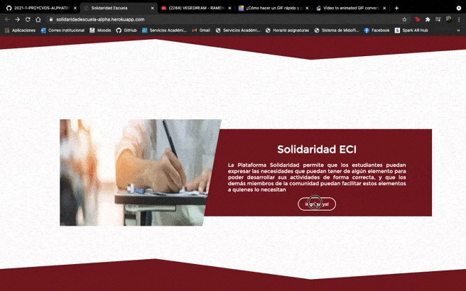
### Rol Estudiante
*1. Inicio de sesión*

*2. Registro de Necesidad*

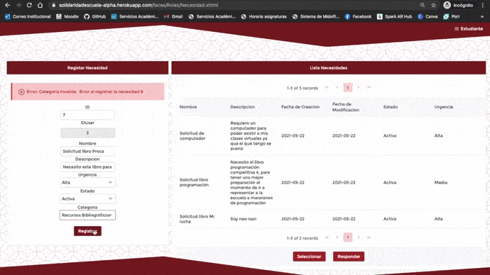

*3. Registro de Oferta*

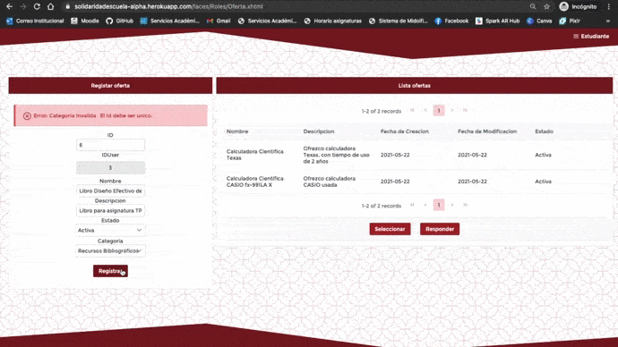

*4. Registrar Respuesta del Estudiante y Visualizar Respuesta*

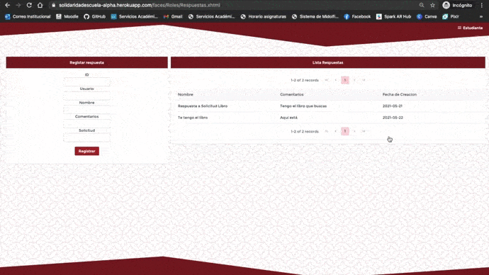

### Rol Estudiante 2

*1. Inicio de sesión*

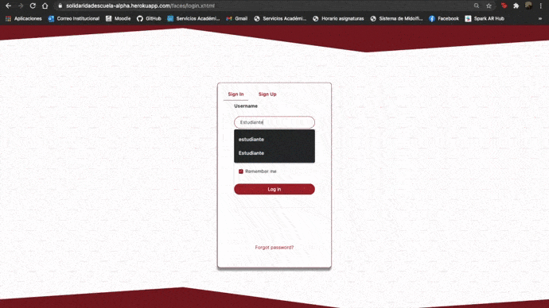

*2. Registro de Necesidad*

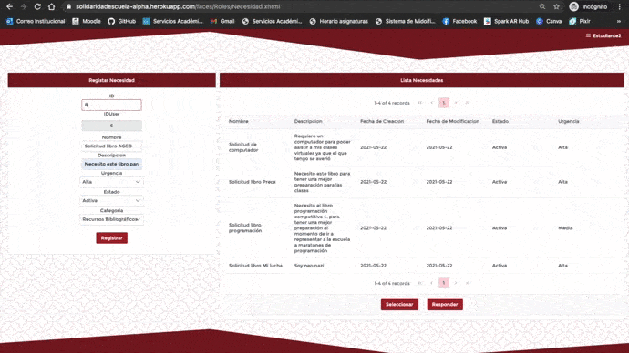

*3. Registro de Oferta*

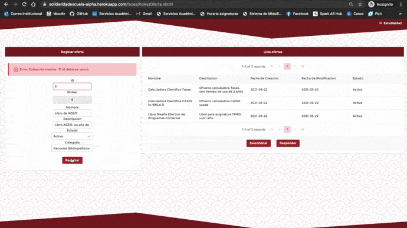

*4. Registrar Respuesta del Estudiante y Visualizar Respuesta*

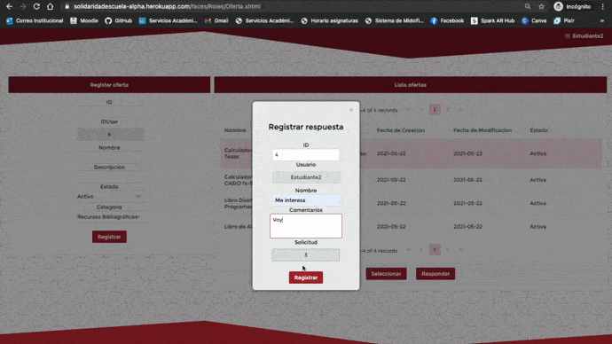

### Rol Egresado

*1. Inicio de sesión*

*2. Registro de Oferta*

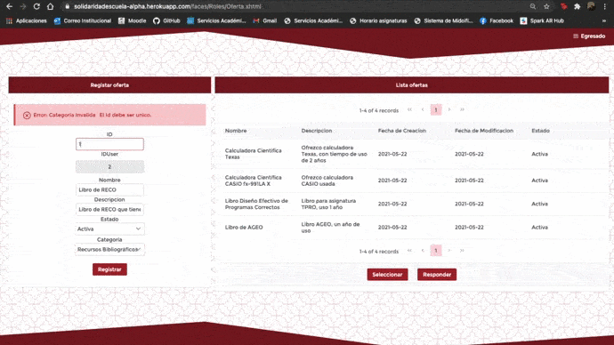

*3. Registrar Respuesta del Egresado y Visualizar Respuesta*

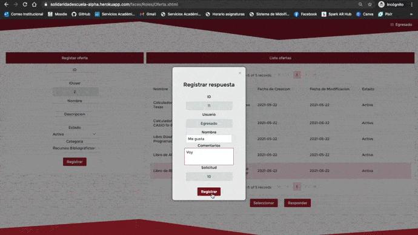

### Rol Profesor

*1. Inicio de sesión*

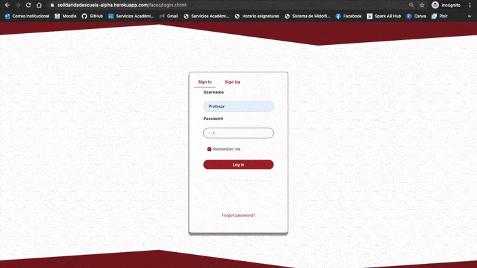

*2. Registro de Oferta*

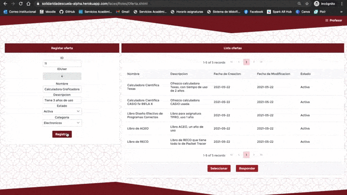

*3. Registrar Respuesta del Profesor y Visualizar Respuesta*

### Administrativo

*1. Inicio de sesión*

*2. Registro de Oferta*

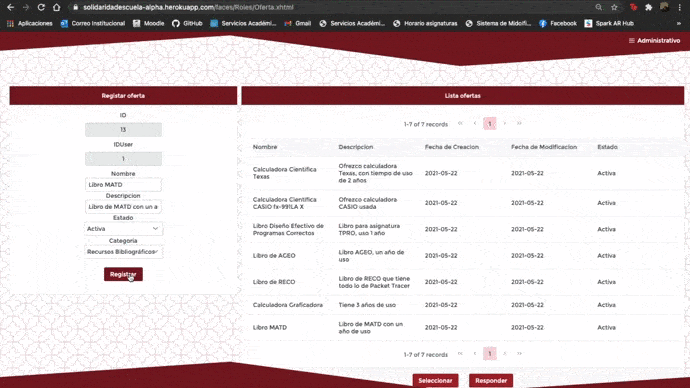

*3. Registrar Respuesta del Administrativo y Visualizar Respuesta*

### Administrador

*1. Inicio de sesión*

*2. Registro de Categoría*

*3. Registrar Necesidad*

*4. Registrar Oferta*

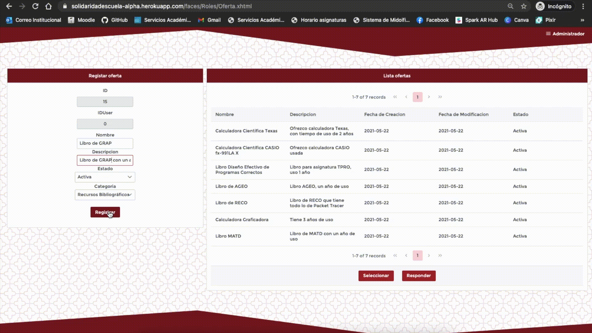

*5. Registrar Usuarios*

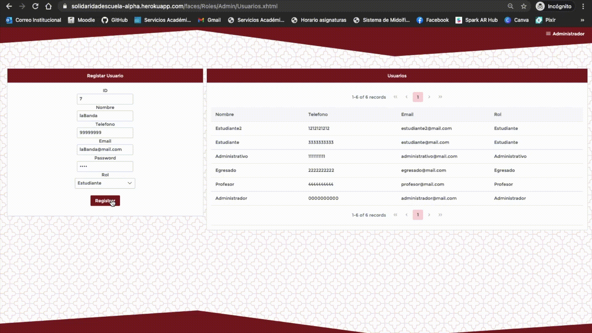

*6. Registrar Respuesta del Administrativo y Visualizar Respuesta*

## Arquitectura y Diseño Detallado
### Modelo E-R  :mag:

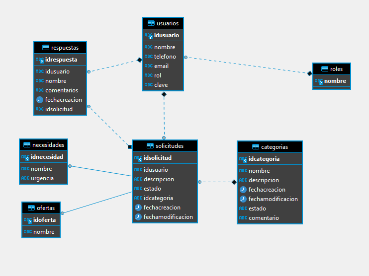
### Diagrama de Clases :clipboard:
*Si requiere el diagrama de clases con los metodos diríjase al archivo .asta que se encuentra en el repositorio*
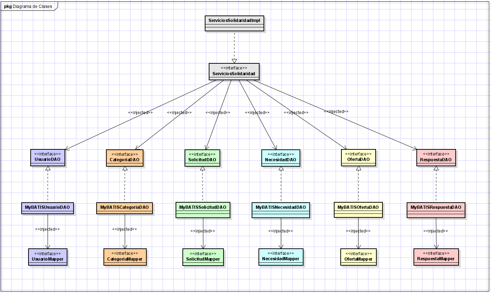
### Arquitectura y Stack de tecnologías utilizado 🛠️
*Se contruyó la aplicación con 3 capas:*
*   ***Capa de Aplicación:*** *En esta capa fue utilizado el lenguaje **Java**, el framework de inyección de dependencias **Google Guice** y el framework para la autenticación  **Apache Shiro**.*
*   ***Capa de Presentación:*** *En esta capa se utilizó un framework que simplifica el desarrollo de interfaces de usuario en aplicaciones **Java JavaServer Faces (JSF)** y asi mismo su biblioteca de componentes **PrimeFaces**.*
*   ***Capa de Persistencia:*** *Para lograr una persistencia sobre los datos se uso el motor de base de datos **PostgreSQL** y la herramienta de persistencia Java para mapear sentencias SQL **myBatis**.*
### Enlace a la aplicación en Heroku :link:
https://solidaridadescuela-alpha.herokuapp.com
### Enlace al sistema de integración continua :link:
https://app.circleci.com/pipelines/github/2021-1-PROYCVDS-ALPHATECH
## Descripción del proceso
### Descripción de la Metodologia :page_facing_up:
*Durante el desarrollo del proyecto se aplicó la metodología **Scrum** en la cual se realizan entregas parciales y regulares del producto final con reuniones diarias, donde se realizan preguntas como: ¿Qué se realizó el día anterior?, ¿Qué impedimentos se han tenido? y ¿Qué se hará en el día?*
### Enlace Taiga :link:

https://tree.taiga.io/project/j-382-solidaridad-escuela/backlog
### Sprints :chart:
*Para el proyecto se manejaron 3 Sprints de aproximadamente 2 semanas cada uno*
*   **Sprint 1**  
    *El principal problema que se tuvo, fue con el tema de la autenticación, los ejemplos para la configuración de shiro no eran muy claros y se presentaron varios inconvenientes con los servicios default para la comparación de contraseñas.*
    *   ***Sprint-backlog***  

    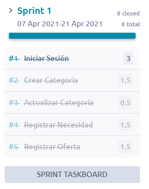
    *   ***Sprint-burndown chart***  

    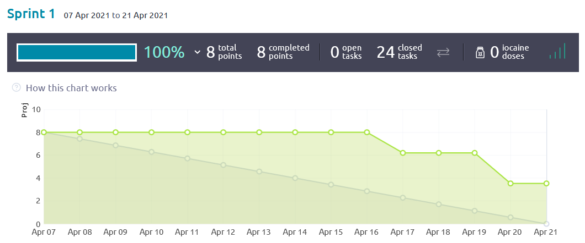

*   **Sprint 2**  
    *A pesar de que primefaces cuenta con un dataexporter para la información de las tablas, esta se quedaba corta para la funcionalidad requerida, por lo que se tuvieron que programar métodos auxiliares que permitieran adjuntar las gráficas generadas al archivo pdf y excel.*
    *Adicional, para el manejo de las respuestas como se plantea en la especificación del proyecto se consideró necesario hacer un remodelamiento en la base de datos.*
    *   ***Sprint-backlog***  

    
    *   ***Sprint-burndown chart***  

    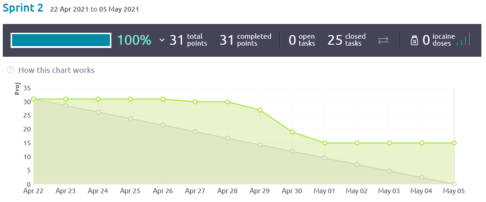

*   **Sprint 3**  
    *Al principio de sprint, no se tenía muy claro según lo que se podía intuir de la especificación el como realizar la implmentación de la historia de usuario para el manejo de las categorias invalidas.*
    *Además se tuvo que cambiar la forma en la que se tenía implemantada la gestión del número de solicitudes*
    *   ***Sprint-backlog***  

    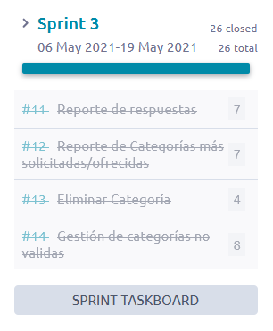  
    *   ***Sprint-burndown chart***  

    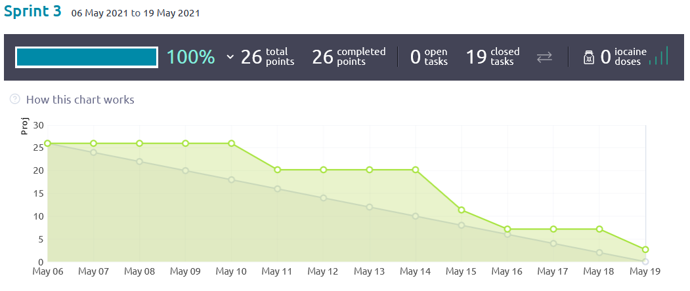
### Reporte de Pruebas :bar_chart:

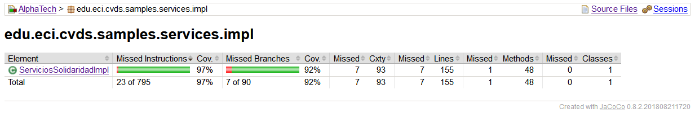
